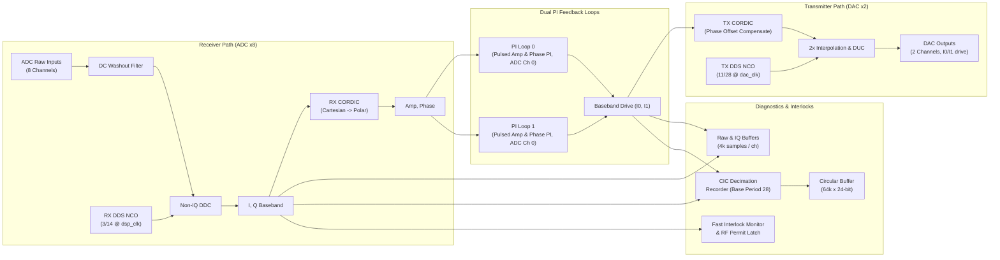

# LEMP Facility DSP Configuration

This directory contains the DSP configuration and static register mapping for the **SLAC LEMP (Linac Electronics Modernization Project)** application.

## Frequency and Clocking Summary

| Signal | Ratio | Frequency | Unit |
| :---: | :---: | :---: | :---: |
| Master Oscillator (MO) | - | 2856.000 | MHz |
| Local Oscillator (LO) | MO / 112 * 111 | 2830.500 | MHz |
| DSP Clock (`dsp_clk`) | MO / 24 | 119.000 | MHz |
| DAC Clock (`dac_clk`) | MO / 12 | 238.000 | MHz |
| ADC IF (`IF_adc`) | MO / 112 | 25.500 | MHz |
| DAC IF (`IF_dac`) | MO / 336 * 11 | 93.500 | MHz |
| ADC IF / `dsp_clk` | 3 / 14 | - | - |
| DAC IF / `dac_clk` | 11 / 28 | - | - |
| GT ref_clk | MO / 4 | 119.000 | MHz |

- **Zest Reference Clock**: MO (2856 MHz)

---

## Simplified DSP Architecture



---

## DSP Configuration & Calibration Factors

### `dsp_config['LEMP']`
```python
{
    'DSP_CLK_CYCLE': 8.4,           # ns (~119 MHz)
    'LO_AMP': 74840,                # DDS LO Amplitude
    'NUM_DDS': 3,                   # RX DDS Numerator
    'DEN_DDS': 14,                  # RX DDS Denominator (IF/Fs = 3/14)
    'TX_NUM_DDS': 11,               # TX DDS Numerator
    'TX_DEN_DDS': 28,               # TX DDS Denominator (IF/Fs = 11/28)
    'TX_SECOND_NYQUIST': False,     # 1st Nyquist zone
    'CIC_BASE_PERIOD': 28,          # CIC base decimation period
    'CIC_SHIFT_BASE': 7,
    'INLK_SHIFT_BASE': 11,
    'INLK_SHIFT_ADD': 1,
    'PRL_ADC_CHAN': 3,              # Phase reference ADC channel
    'LOOP0_ADC_CHAN': 0,            # Feedback ADC channel for Loop 0
    'LOOP1_ADC_CHAN': 0,            # Feedback ADC channel for Loop 1
    'DAC_DRIVE_SEL': 2,             # 2: I0I1 mode
    'PULSE_MODES': 3,               # Pulsed mode enabled
    'EVCODE': 151
}
```

### Calibration Factors
- **`rx_gain`**: `3.114013`
- **`tx_gain`**: `1.548405`
- **`rx_phase_off_deg`**: `2.3164°`
- **`tx_phase_off_deg`**: `115.7143°`
- **`rx_dds_omega_deg`**: `77.1429°`
- **`tx_dds_omega_deg`**: `141.4286°`
- **`cic_wfm_gain`**: `11.582334`
- **`inlk_gain`**: `0.596041`
- **`inlk_tx_gain`**: `-0.335222j`
- **`rx_iq_gain`**: `1.890993`
- **`tx_iq_gain`**: `0.940274j`
- **`max_amp_setpoint`**: `20104`

---

## Memory Map & Static Registers

### Static Buffers (12-bit depth = 4096 samples, 18-bit signed I/Q)
| Buffer Name | Base Address (Hex) | Word Width | Access | Description |
| :--- | :---: | :---: | :---: | :--- |
| `adc0_buf` .. `adc7_buf` | `0x12000` - `0x19000` | 16-bit signed | R | Raw ADC waveform buffers (4k each) |
| `adc0_i_buf` .. `adc7_i_buf` | `0x1c000` - `0x23000` | 18-bit signed | R | ADC demodulated In-phase buffers |
| `drv0_i_buf`, `drv1_i_buf` | `0x24000`, `0x25000` | 18-bit signed | R | DAC drive In-phase buffers |
| `adc0_q_buf` .. `adc7_q_buf` | `0x26000` - `0x2d000` | 18-bit signed | R | ADC demodulated Quadrature buffers |
| `drv0_q_buf`, `drv1_q_buf` | `0x2e000`, `0x2f000` | 18-bit signed | R | DAC drive Quadrature buffers |
| `circle_data` | `0x30000` | 24-bit signed | R | Circular buffer waveform recorder (64k depth) |

### Status & Diagnostic Registers
| Register Name | Base Address (Hex) | Width / Sign | Access | Description |
| :--- | :---: | :---: | :---: | :--- |
| `llrf_circle_ready` | `0x10800` | 2-bit unsigned | R | Circular buffer status |
| `sig_buf_ready` | `0x10801` | 8-bit unsigned | R | Raw ADC buffers ready mask |
| `sig_iq_buf_ready` | `0x10802` | 20-bit unsigned | R | IQ buffers ready mask |
| `dsp_slow_data` | `0x10900` | 16-bit unsigned | R | Slow bridge streaming data |
| `mon_amp` | `0x10a00` | 16-bit signed (x16) | R | Channel amplitude monitor array |
| `mon_phs` | `0x10a10` | 17-bit signed (x16) | R | Channel phase monitor array |
| `rf_pwr_status` / `latch` | `0x00003` / `0x00005`| 10-bit unsigned | R | RF power interlock status and latched bits |
| `arc_permit_sum` | `0x00009` | 1-bit unsigned | R | ARC interlock overall permit |
| `loop0_amp_err`, `phs_err` | `0x0000a`, `0x0000b` | 15-bit signed | R | Loop 0 amplitude and phase error monitors |
| `loop1_amp_err`, `phs_err` | `0x0000c`, `0x0000d` | 15-bit signed | R | Loop 1 amplitude and phase error monitors |
| `evr_live_ts_lo` / `hi` | `0x00020` / `0x00021` | 32-bit unsigned | R | EVR live 64-bit timestamp |

### Control & Configuration Registers (Mapped to `0x11000`+)
| Register Name | Width / Sign | Access | Description |
| :--- | :---: | :---: | :--- |
| `rx_dds_phase_step` | 32-bit unsigned | RW | RX DDS NCO phase increment (`920350128`) |
| `rx_dds_phase_shift` | 19-bit signed | RW | RX DDS CORDIC phase offset (`3373`) |
| `rx_dds_modulo` | 12-bit unsigned | RW | RX DDS phase accumulator modulo (`8`) |
| `rx_dds_amplitude` | 18-bit unsigned | RW | RX DDS LO amplitude (`74840`) |
| `tx_dds_phase_step` | 32-bit unsigned | RW | TX DDS NCO phase increment (`1687308576`) |
| `tx_dds_phase_shift` | 19-bit signed | RW | TX DDS CORDIC phase offset (`168521`) |
| `tx_dds_modulo` | 12-bit unsigned | RW | TX DDS phase accumulator modulo (`8`) |
| `tx_dds_amplitude` | 18-bit unsigned | RW | TX DDS LO amplitude (`74840`) |
| `tx_phase_offset` | 19-bit signed | RW | TX baseband phase compensation (`-131072`) |
| `loop0_amp_setpoint` | 18-bit signed | RW | Loop 0 Amplitude setpoint |
| `loop0_phs_setpoint` | 18-bit signed | RW | Loop 0 Phase setpoint |
| `loop0_pulse_start` | 24-bit unsigned | RW | Loop 0 pulse modulation start time |
| `loop0_pulse_high_len` | 24-bit unsigned | RW | Loop 0 pulse width length |
| `pulse_modes` | 2-bit unsigned | RW | Pulse mode enable (`3`) |
| `wave_samp_per` | 7-bit unsigned | RW | CIC decimation multiplier (default `1`) |
| `chan_keep` | 10-bit unsigned | RW | Bitmask of captured channels in circular buffer |
| `dac_drive_sel` | 2-bit unsigned | RW | DAC multiplexer selection (`2`: I0I1) |
| `prl_adc_chan` | 3-bit unsigned | RW | Phase reference channel (`3`) |
| `loop0_adc_chan`, `loop1_adc_chan` | 3-bit unsigned | RW | Loop 0/1 feedback channel (`0`) |
| `evcode` | 8-bit unsigned | RW | Event receiver trigger code (`151`) |
