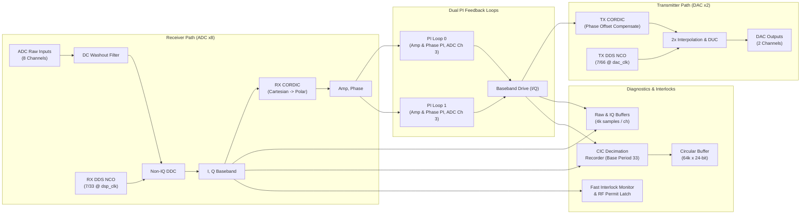

# VTS Facility DSP Configuration

This directory contains the DSP configuration and static register mapping for the **Fermilab Vertical Test Stand (VTS)** LLRF application.

## Frequency and Clocking Summary

| Signal | Ratio | Frequency | Unit |
| :---: | :---: | :---: | :---: |
| Master Oscillator (MO) | - | 1295.275 | MHz |
| Local Oscillator (LO) | MO / 65 * 66 | 1315.202 | MHz |
| DSP Clock (`dsp_clk`) | LO / 14 | 93.943 | MHz |
| DAC Clock (`dac_clk`) | LO / 7 | 187.886 | MHz |
| ADC IF (`IF_adc`) | MO / 65 | 19.927 | MHz |
| DAC IF (`IF_dac`) | MO / 65 | 19.927 | MHz |
| ADC IF / `dsp_clk` | 7 / 33 | - | - |
| DAC IF / `dsp_clk` | 7 / 33 | - | - |

- **Zest Reference Clock**: LO (1315.202 MHz)

---

## Simplified DSP Architecture



---

## DSP Configuration & Calibration Factors

### DSP Configuration Parameters
```python
{
    'DSP_CLK_CYCLE': 10.64,         # ns (~93.943 MHz)
    'LO_AMP': 74762,                # DDS LO Amplitude
    'NUM_DDS': 7,                   # RX DDS Numerator
    'DEN_DDS': 33,                  # RX DDS Denominator (IF/Fs = 7/33)
    'TX_NUM_DDS': 7,                # TX DDS Numerator
    'TX_DEN_DDS': 66,               # TX DDS Denominator (IF/Fs = 7/66 @ dac_clk)
    'TX_SECOND_NYQUIST': False,     # 1st Nyquist zone
    'CIC_BASE_PERIOD': 33,          # CIC base decimation period
    'CIC_SHIFT_BASE': 7,
    'INLK_SHIFT_BASE': 11,
    'INLK_SHIFT_ADD': 1,
    'PRL_ADC_CHAN': 0,              # Phase reference ADC channel
    'LOOP0_ADC_CHAN': 3,            # Feedback ADC channel for Loop 0
    'LOOP1_ADC_CHAN': 3,            # Feedback ADC channel for Loop 1
    'DAC_DRIVE_SEL': 0,             # 0: I0Q0 mode
    'PULSE_MODES': 0,               # CW mode
    'EVCODE': 5
}
```

### Calibration Factors
- **`rx_gain`**: `3.100752`
- **`tx_gain`**: `1.548405`
- **`rx_phase_off_deg`**: `2.3489°`
- **`tx_phase_off_deg`**: `-38.1818°`
- **`rx_dds_omega_deg`**: `76.3636°`
- **`tx_dds_omega_deg`**: `38.1818°`
- **`cic_wfm_gain`**: `8.009853`
- **`inlk_gain`**: `0.824394`
- **`inlk_tx_gain`**: `0.344876 + 0.313462j`
- **`rx_iq_gain`**: `1.882941`
- **`tx_iq_gain`**: `0.697495 - 0.633961j`
- **`max_amp_setpoint`**: `20104`

---

## Memory Map & Static Registers

### Static Buffers (12-bit depth = 4096 samples, 18-bit signed I/Q)
| Buffer Name | Base Address (Hex) | Word Width | Access | Description |
| :--- | :---: | :---: | :---: | :--- |
| `adc0_buf` .. `adc7_buf` | `0x12000` - `0x19000` | 16-bit signed | R | Raw ADC waveform buffers (4k each) |
| `adc0_i_buf` .. `adc7_i_buf` | `0x1c000` - `0x23000` | 18-bit signed | R | ADC demodulated In-phase buffers |
| `drv0_i_buf`, `drv1_i_buf` | `0x24000`, `0x25000` | 18-bit signed | R | DAC drive In-phase buffers |
| `adc0_q_buf` .. `adc7_q_buf` | `0x26000` - `0x2d000` | 18-bit signed | R | ADC demodulated Quadrature buffers |
| `drv0_q_buf`, `drv1_q_buf` | `0x2e000`, `0x2f000` | 18-bit signed | R | DAC drive Quadrature buffers |
| `circle_data` | `0x30000` | 24-bit signed | R | Circular buffer waveform recorder (64k depth) |

### Status & Diagnostic Registers
| Register Name | Base Address (Hex) | Width / Sign | Access | Description |
| :--- | :---: | :---: | :---: | :--- |
| `llrf_circle_ready` | `0x10800` | 2-bit unsigned | R | Circular buffer status |
| `sig_buf_ready` | `0x10801` | 8-bit unsigned | R | Raw ADC buffers ready mask |
| `sig_iq_buf_ready` | `0x10802` | 20-bit unsigned | R | IQ buffers ready mask |
| `dsp_slow_data` | `0x10900` | 16-bit unsigned | R | Slow bridge streaming data |
| `mon_amp` | `0x10a00` | 16-bit signed (x16) | R | Channel amplitude monitor array |
| `mon_phs` | `0x10a10` | 17-bit signed (x16) | R | Channel phase monitor array |
| `rf_pwr_status` / `latch` | `0x00003` / `0x00005`| 10-bit unsigned | R | RF power interlock status and latched bits |
| `arc_permit_sum` | `0x00009` | 1-bit unsigned | R | ARC interlock overall permit |
| `loop0_amp_err`, `phs_err` | `0x0000a`, `0x0000b` | 15-bit signed | R | Loop 0 amplitude and phase error monitors |
| `loop1_amp_err`, `phs_err` | `0x0000c`, `0x0000d` | 15-bit signed | R | Loop 1 amplitude and phase error monitors |
| `evr_live_ts_lo` / `hi` | `0x00020` / `0x00021` | 32-bit unsigned | R | EVR live 64-bit timestamp |

### Control & Configuration Registers (Mapped to `0x11000`+)
| Register Name | Width / Sign | Access | Description |
| :--- | :---: | :---: | :--- |
| `rx_dds_phase_step` | 32-bit unsigned | RW | RX DDS NCO phase increment (`911053668`) |
| `rx_dds_phase_shift` | 19-bit signed | RW | RX DDS CORDIC phase offset (`3420`) |
| `rx_dds_modulo` | 12-bit unsigned | RW | RX DDS phase accumulator modulo (`4`) |
| `rx_dds_amplitude` | 18-bit unsigned | RW | RX DDS LO amplitude (`74762`) |
| `tx_dds_phase_step` | 32-bit unsigned | RW | TX DDS NCO phase increment (`455526834`) |
| `tx_dds_phase_shift` | 19-bit signed | RW | TX DDS CORDIC phase offset (`-55611`) |
| `tx_dds_modulo` | 12-bit unsigned | RW | TX DDS phase accumulator modulo (`4`) |
| `tx_dds_amplitude` | 18-bit unsigned | RW | TX DDS LO amplitude (`74762`) |
| `tx_phase_offset` | 19-bit signed | RW | TX baseband phase compensation (`77451`) |
| `loop0_amp_setpoint` | 18-bit signed | RW | Loop 0 Amplitude setpoint |
| `loop0_phs_setpoint` | 18-bit signed | RW | Loop 0 Phase setpoint |
| `loop0_Kp_amp`, `Ki_amp` | 18-bit signed | RW | Loop 0 Amplitude PI gains |
| `loop0_Kp_phs`, `Ki_phs` | 18-bit signed | RW | Loop 0 Phase PI gains |
| `loop0_amp_enable`, `phs_enable` | 1-bit unsigned | RW | Loop 0 PI loop enable flags |
| `wave_samp_per` | 7-bit unsigned | RW | CIC decimation multiplier (default `1`) |
| `chan_keep` | 10-bit unsigned | RW | Bitmask of captured channels in circular buffer |
| `dac_drive_sel` | 2-bit unsigned | RW | DAC multiplexer selection (`0`: I0Q0) |
| `prl_adc_chan` | 3-bit unsigned | RW | Phase reference channel (`0`) |
| `loop0_adc_chan`, `loop1_adc_chan` | 3-bit unsigned | RW | Loop 0/1 feedback channel (`3`) |
