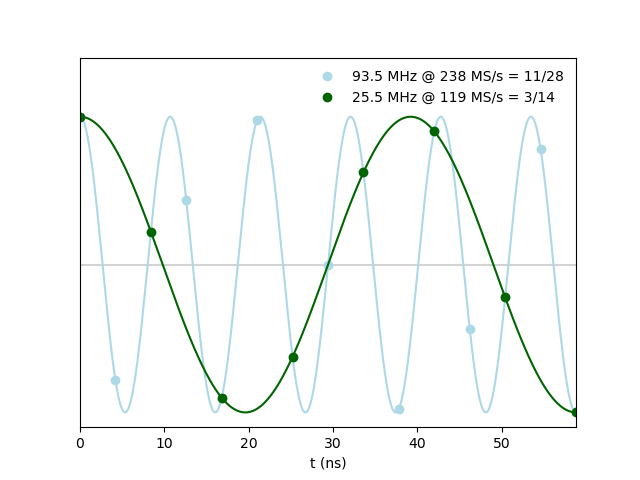

# DAC output frequency settings

As shown in the following diagram of the digitizer board support,
the DAC sampling clock is double of the ADC sampling clock, which is the same as the DSP clock.

$$
    f_{dac\_clk} = 2 f_{adc\_clk} = 2 f_{dsp\_clk}
$$

A interpolation module (`bedrock/board_support/zest_soc/zest_dac_interp.v`) is responsible to send the DAC output data
across the DSP and DAC clock domains, and insert the interpolated data sample, with a constant coefficient factor $r$, so that the input and output data samples
are:

- Input : $s_0, s_1, s_2, \cdots, s_k$
- Output: $s_0, r\frac{s_0 + s_1}{2}, s_1, r\frac{s_1 + s_2}{2}, s_2, \cdots, s_{2k}$

$r$ is determined by the fractional frequency $\omega$ of $f_{IF\_dac}$:

$$
    r = \frac{1}{\cos(\omega)}, \qquad \omega = 2*\pi*\frac{f_{IF\_dac}}{f_{dac\_clk}}
$$

Obviously for $f_{IF\_dac} = f_{IF\_adc}$, the nominal value of $r$ is 1, and the resulting interpolation is just the average of the surrounding samples.

## Proof of general case

In the output data sample series, the odd sample $\cos((2k+1)\omega)$ can be derived by the surrounding even samples:

$$
    \cos(2k\omega) + \cos((2k+2)\omega) = 2\cos(\omega)\cos((2k+1)\omega)
$$

or

$$
    \cos((2k+1)\omega) = \frac{\cos(2k\omega) + \cos((2k+2)\omega)}{2} \cdot r
$$

## Example in LEMP

|    **Signal**    |    **Ratio**   | **Value** |     |
|:----------------:|:--------------:|:---------:|:---:|
|        MO        |                | 2856      | MHz |
|        IF        |    MO / 112    | 25.5      | MHz |
|        LO        | MO / 112 * 111 | 2830.5    | MHz |
|      dsp_clk     |     MO / 24    | 119       | MHz |
| IF_adc / dsp_clk |     3 / 14     |           |     |
|      dac_clk     |     MO / 12    | 238       | MHz |
| IF_dac           | MO / 336 * 11  | 93.5      | MHz |
| IF_dac / dac_clk |     11 / 28    |           |     |

$r = 1/\cos(\omega) = 1/\cos(2*\pi*11/28) \simeq -1.279$,
as in `settings.mk` where `CFG_LEMP_DAC_INTERP_COEFF_R = -1.279`.

