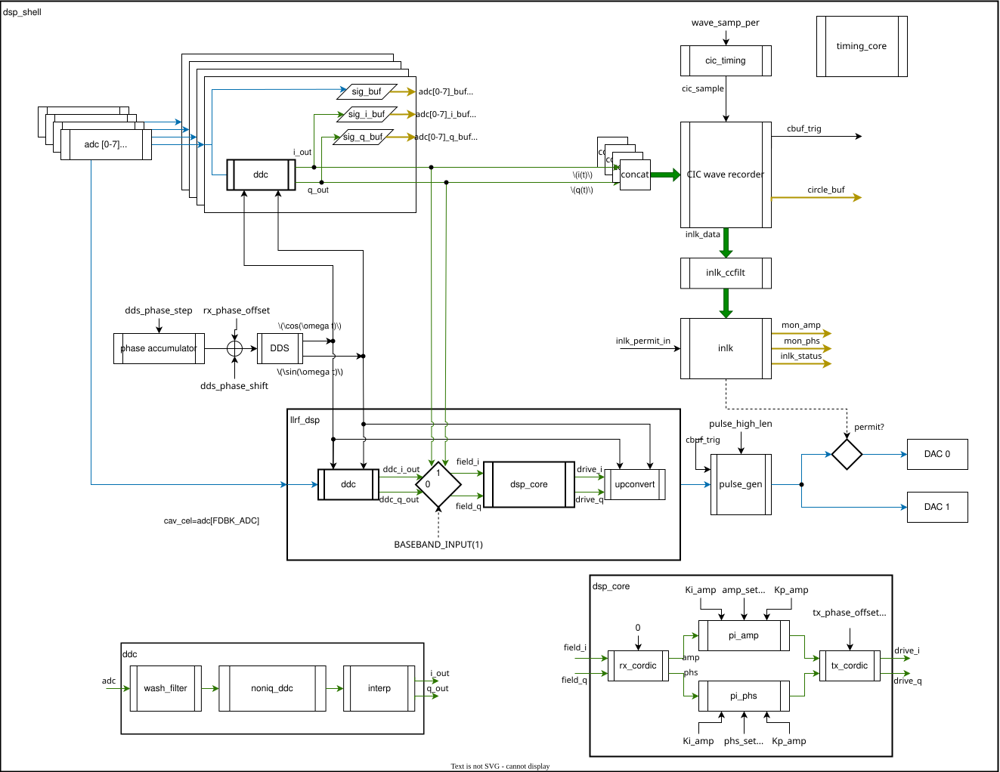

# USPAS LLRF firmware

## Digital Down-Conversion (DDC)

For high precision digitization, [Non-IQ direct digital down-conversion](https://accelconf.web.cern.ch/l06/papers/thp004.pdf) is used to avoid aliasing.

With the normalized ADC IF frequency $\omega_d = 2\pi\frac{f_\text{IF\_ADC}}{f_\text{S}}$, the DDC NCO provides LO data streams of $\cos(n\omega_d)$ and $\sin(n\omega_d)$:

$$
\begin{pmatrix}
    I_n \\
    Q_n
\end{pmatrix}
= \frac{1}{\sin\omega_d}
\begin{pmatrix}
    \sin(n\omega_d)    & -\sin((n-1)\omega_d) \\
    -\cos(n\omega_d)   & \cos((n-1)\omega_d)
\end{pmatrix}
\begin{pmatrix}
    y_{n-1} \\
    y_n
\end{pmatrix}
$$

RTL implementation is in [`noniq_ddc.v`](llrf_dsp/noniq_ddc.v), where a serialized stream of IQ data is generated.
An interpolation module `fiq_interp.v` is used to convert to parallel I and Q sample streams. A DC-blocking module `fwashout.v` is inserted before the `noniq_ddc.v`. The full DDC is packaged in [`ddc.v`](llrf_dsp/ddc.v).

## Digital Up-Conversion (DUC)

A generic digital up-conversion scheme is implemented, in the `dac_clk` domain.

With the normalized DAC IF frequency $\omega_c = 2\pi\frac{f_\text{IF\_DAC}}{f_\text{S}}$, given a complex base band signal $I_n + jQ_n$, the up-converted signal $y_n$ is:

$$
\begin{align*}
    y_n &= (I_n + jQ_n) \cdot e^{jn\omega_c} \\
    &= I_n\cos(n\omega_c) - Q_n\sin(n\omega_c) + j\left( Q_n\cos(n\omega_c) + I_n\sin(n\omega_c) \right) \\
    \Re(y_n) &= I_n\cos(n\omega_c) - Q_n\sin(n\omega_c) \\
    \Im(y_n) &= Q_n\cos(n\omega_c) + I_n\sin(n\omega_c)
\end{align*}
$$

Or in matrix form, for DUC to first Nyquist zone:

$$
\begin{pmatrix}
    I_{y,n} \\
    Q_{y,n}
\end{pmatrix}
=
\begin{pmatrix}
    I_n & -Q_n \\
    Q_n & I_n
\end{pmatrix}
\begin{pmatrix}
    \cos(n\omega_c) \\
    \sin(n\omega_c)
\end{pmatrix},
\qquad \omega_c \in (-\pi, \pi)
$$

To avoid aliasing, condition $\omega_c \in (-\pi, \pi)$ is due to the [Nyquist–Shannon sampling theorem](https://en.wikipedia.org/wiki/Nyquist%E2%80%93Shannon_sampling_theorem).

When operating in the [under-sampling](https://en.wikipedia.org/wiki/Undersampling) scheme, the signal location at the first Nyquist zone must be calculated to derive the effective NCO frequency value.

For example, the up conversion from base band to the 2nd Nyquist zone (i.e. $\frac{f_\text{S}}{2} < f_\text{IF\_DAC} < f_\text{S}$) is illustrated at Figure 32 (b) in [NCO Setting Examples](https://docs.amd.com/r/en-US/pg269-rf-data-converter/NCO-Frequency-Conversion), where the NCO frequency is set to be $-f_\text{IF\_DAC}$. This flip of sign is known as the spectral inversion due to frequency folding around the Nyquist frequency.

Equation of DUC to the second Nyquist zone:
$$
\begin{pmatrix}
    I_{y,n} \\
    Q_{y,n}
\end{pmatrix}
=
\begin{pmatrix}
    I_n & Q_n \\
    Q_n & -I_n
\end{pmatrix}
\begin{pmatrix}
    \cos(n\omega_c) \\
    \sin(n\omega_c)
\end{pmatrix},
\qquad \omega_c \in (\pi, 2\pi)
$$

This approach is consistent with the NCO Modulator in many RF-DACs such as the [AD9174 (Figure 79)](https://www.analog.com/media/en/technical-documentation/data-sheets/AD9174.pdf), and the [AMD RFSoC](https://docs.amd.com/r/en-US/pg269-rf-data-converter/RF-DAC-Numerical-Controlled-Oscillator-and-Mixer), where a standalone NCO with configurable frequency and phase is instantiated, allowing 1st or 2nd Nyquist zone modulation.

## LLRF DSP

