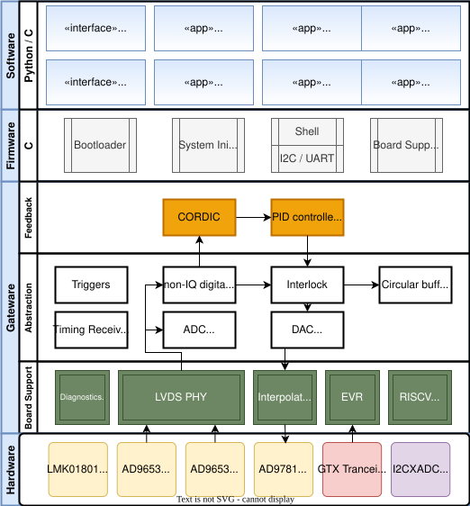
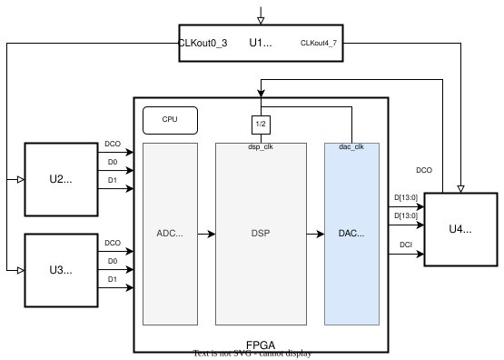
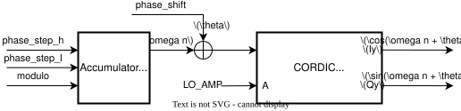
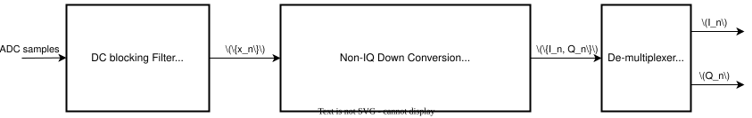
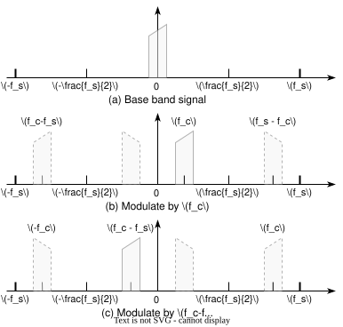
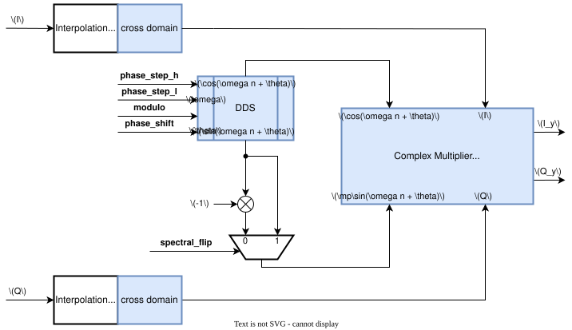
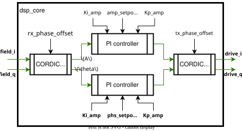

# USPAS LLRF System Design

[[_TOC_]]

## Overall Architecture



## Development tools

As part of the full-stack open source firmware development in Berkeley Lab, we leverage a collection of open source tools including [Icarus Verilog](https://github.com/steveicarus/iverilog), [`verilator`](https://github.com/verilator/verilator), [cocotb](https://github.com/cocotb/cocotb), [yosys](https://github.com/YosysHQ/yosys), and Jupyter notebooks for demonstration and documentation.

* For `conda` users, a python virtual environment can be created as:

  ```
  conda env create -f python/environment.yml
  conda activate uspas_llrf
  ```

* `gitlab` Continuous Integration is enabled in this repository as defined [here](.gitlab-ci.yml), including steps of:
  * Coding style sanity checking using `flake8`;
  * `cocotb` LLRF DSP behavioral verification;
  * Clock domain crossing validation;
  * Bit-stream synthesize for all supported variants of applications;
  * Hardware in-the-loop testing;

## Firmware and Gateware

### Applications and settings

The following of pre-defined LLRF applications are supported, and their frequency settings are described in [README.md](./README.md).

* `USPAS`: For USPAS LLRF class taught in 2023.
* `ALSU`: For LBNL ALS-U AR LLRF system.
* `LEMP`: SLAC Linac Electronics Modernization Project
* `AWA`: Argonne AWA facility

Detailed description of settings:

* LLRF DSP:
  All configurations are contained in [llrf_dsp/settings.json].
* Board Support:
  For each application, customized hardware settings and LLRF configurations can be found in `soc/marble_zest/`, where each application's configuration files for FPGA carrier and digitizer are located at.

## System-On-Chip architecture

A RISC-V soft core [PicoRV32](https://github.com/YosysHQ/picorv32) is used for peripheral control, booting and diagnostics.
We leverage the the cross-compiler tool and common modules described in Berkeley Lab's [Bedrock](https://github.com/BerkeleyLab/Bedrock/tree/master/soc/picorv32) repository.

The design can be found in [soc/marble_zest](soc/marble_zest), where:

* Open source RTL simulation:
  See [soc/marble_zest/sim](soc/marble_zest/sim), for the booting process, using purely icarus verilog.
* Full RTL simulation:
  See [soc/marble_zest/top_sim](soc/marble_zest/top_sim). This simulation process requires Xilinx vivado command tools like `xvlog` and `xelab`, for building and execution respectively.
  This allows the use of UNISIM models provided by vivado's installation package, for a complete behavioral verification of Xilinx primitives including XADC, ISERDES, etc, which is needed for the development of board support package with LVDS digitizer interface.
* Hardware test: See [soc/marble_zest/synth](soc/marble_zest/synth), where two functions are implemented:
  * Synthesis: A minimal structured bitstream file containing only the soft core and essential peripherals.
  * Boot-loading: The CPU program memory in the deployed production bitstream can be updated using a boot-loading process thanks to a built-in bootloader.
    This is a well known technique in embedded system designs, and provides flexible and quick iterations for development / troubleshooting.
    Details and examples can be found in [soc/marble_zest/synth/README.md](soc/marble_zest/synth/README.md).

## Top level synthesize

We use LBNL Bedrock's Makefile based building system to find dependencies and synthesize the bitstream file at [top/marble_zest](top/marble_zest), where the top level RTL `marble_zest_top.v` assembles the soft core, board support package and LLRF DSP together.

## Board Support Package (BSP)

### FPGA carrier ([Marble](https://github.com/BerkeleyLab/marble))

See [marble_bsp/marble_bsp.v](marble_bsp/marble_bsp.v), which features:
* LBNL local bus control interface;
* LBNL Gigabit Ethernet UDP engine ([Packet Badger](https://github.com/BerkeleyLab/Bedrock/tree/master/badger));
* LBNL 8b10b MRF timing event receiver (EVR);
* LBNL Marble micro-controller (MMC) mail-box interface;
* External trigger logic;

### Digitizer ([Zest](https://github.com/BerkeleyLab/zest))

See [bedrock/board_support/zest_soc](https://github.com/BerkeleyLab/Bedrock/tree/master/board_support/zest_soc).

### Clocking

As shown in the following diagram of the digitizer (Zest) board support,
the clock distribution chip (LMK01801) receives an external reference clock,
and the outputs of two divider groups drives ADC (AD9563) and DAC (AD9781) respectively,
where the DAC sampling clock is double of the ADC sampling clock, which is the same as the DSP clock.



$$
    f_\text{dac\_clk} = 2 f_\text{adc\_clk} = 2 f_\text{dsp\_clk}
$$

## Digital Signal Processing (DSP)

### Numerical Models for simulation

  A collection of LLRF DSP numerical models can be found in [llrf_dsp/llrf_model/lrf_dsp.py](llrf_dsp/llrf_model/llrf_dsp.py), which is shared among all simulations.

  The complete feedback controller is modeled, and it can be used for `cocotb` simulation with cavity emulators, whose parameters are defined in [llrf_dsp/llrf_model/cavity.json](llrf_dsp/llrf_model/cavity.json).
  The detailed cavity model co-simulation with discrete signal process is explained in [llrf_dsp/llrf_model/lti.ipynb](llrf_dsp/llrf_model/lti.ipynb).

### IQ representation conventions

There are two conventions for IQ decomposition of a RF signal $y$ at carrier frequency $\omega$:

1. Positive carrier frequency:

   As described in [Wikipedia](https://en.wikipedia.org/wiki/In-phase_and_quadrature_components#Narrowband_signal_model),

   $$
   \begin{align*}
       y(t) &= (I + jQ) \cdot e^{j\omega t} \\
       \Re(y(t)) &= I\cos(\omega t) - Q\sin(\omega t)
   \end{align*}
   $$

   This convention is used in this repository.

2. Negative carrier frequency:

   $$
   \begin{align*}
       y(t) &= (I + jQ) \cdot e^{j-\omega t} \\
       \Re(y(t)) &= I\cos(\omega t) + Q\sin(\omega t)
   \end{align*}
   $$

   This convention is used in `bedrock/dsp` RTL modules.

### Digital Direct Synthesis (DDS)

Also known as NCO, it is used to generate a pair of sinusoidal signals at a single frequency, with a known starting phase.
The DSP implementation is shown in the following figure. It is consisted of an phase accumulator and a CORDIC for conversion from Polar to Rectangular coordinate.

* RTL implementation

  See [llrf_dsp/dds.v](llrf_dsp/dds.v).

  

* Simulation

  See [llrf_dsp/tests/dds](llrf_dsp/tests/dds).

### Digital Down-Conversion (DDC)

For high precision digitization, [Non-IQ direct digital down-conversion](https://accelconf.web.cern.ch/l06/papers/thp004.pdf) is used to avoid aliasing.

With the normalized ADC IF frequency $\omega_d = 2\pi\frac{f_\text{IF\_ADC}}{f_\text{S}}$, the DDC NCO provides LO data streams of $\cos(n\omega_d)$ and $\sin(n\omega_d)$. Two measured successive samples are:

$$
\begin{pmatrix}
    x_{n-1} \\
    x
\end{pmatrix}
= \begin{pmatrix}
    \cos((n-1)\omega_d) & -\sin((n-1)\omega_d) \\
    \cos(n\omega_d)     & -\sin(n\omega_d)
\end{pmatrix}
\begin{pmatrix}
    I \\
    Q
\end{pmatrix}
$$

Solve $I$ and $Q$ using inverse matrix:

$$
\begin{pmatrix}
    I \\
    Q
\end{pmatrix}
= \frac{1}{\sin\omega_d}
\begin{pmatrix}
    \sin(n\omega_d)    & -\sin((n-1)\omega_d) \\
    \cos(n\omega_d)    & -\cos((n-1)\omega_d)
\end{pmatrix}
\begin{pmatrix}
    x_{n-1} \\
    x
\end{pmatrix}
$$

* RTL implementation

  RTL implementation is in [`noniq_ddc.v`](llrf_dsp/noniq_ddc.v), where a serialized stream of IQ data is generated.
  An interpolation module `fiq_interp.v` is used to convert to parallel I and Q sample streams. A DC-blocking module `fwashout.v` is inserted before the `noniq_ddc.v`. The full DDC is packaged in [`ddc.v`](llrf_dsp/ddc.v).

  

* Simulation

  See [llrf_dsp/tests/ddc](llrf_dsp/tests/ddc).

### Digital Up-Conversion (DUC)

A generic digital up-conversion scheme is implemented, in the `dac_clk` domain.

With the normalized DAC IF frequency $\omega = 2\pi\frac{f_\text{IF\_DAC}}{f_\text{S}}$ and phase offset $\theta$, given a complex base band signal $I + jQ_n$, the up-converted signal $y$ is:

$$
\begin{align*}
    y &= (I + jQ_n) \cdot e^{jn\omega} \\
    &= I\cos(\omega n + \theta) - Q\sin(\omega n + \theta) + j\left( Q\cos(\omega n + \theta) + I\sin(\omega n + \theta) \right) \\
    \Re(y) &= I\cos(\omega n + \theta) - Q\sin(\omega n + \theta) \\
    \Im(y) &= Q\cos(\omega n + \theta) + I\sin(\omega n + \theta)
\end{align*}
$$

Equation in matrix form:

$$
\begin{pmatrix}
    I_y \\
    Q_y
\end{pmatrix}
=\begin{pmatrix}
    I & -Q \\
    Q & I
\end{pmatrix}
\begin{pmatrix}
    \cos(\omega n + \theta) \\
    \sin(\omega n + \theta)
\end{pmatrix}
$$

To avoid aliasing, condition $\omega \in (-\pi, \pi)$ is due to the [Nyquist–Shannon sampling theorem](https://en.wikipedia.org/wiki/Nyquist%E2%80%93Shannon_sampling_theorem).

When operating in the [under-sampling](https://en.wikipedia.org/wiki/Undersampling) scheme, the signal location at the first Nyquist zone must be calculated to derive the effective NCO frequency value.
The following figure illustrates two cases of modulation at carrier frequency $f_c$ with sampling frequency $f_s$:



* First Nyquist zone: $0 < f_c < \frac{f_s}{2}$, see case (b).
* Second Nyquist zone: $\frac{f_s}{2} < f_c < f_s$, see case (c). The NCO frequency is set to be $-(f_s - f_c)$ or $-f_c$. This flip of sign is known as the spectral inversion due to [frequency folding](https://en.wikipedia.org/wiki/Nyquist_frequency#Folding_frequency) around the Nyquist frequency.

* RTL implementation

  In practice, this spectral inversion is implemented by simply flipping the sign of the $\sin(\omega n + \theta)$ for the LO to rotate in a counter clock wise direction.

  

* Simulation

  See [llrf_dsp/tests/duc](llrf_dsp/tests/duc).

This approach is consistent with the NCO Modulator in many RF-DACs such as the [AD9174 (Figure 79)](https://www.analog.com/media/en/technical-documentation/data-sheets/AD9174.pdf), and the [AMD RFSoC](https://docs.amd.com/r/en-US/pg269-rf-data-converter/RF-DAC-Numerical-Controlled-Oscillator-and-Mixer) with its [NCO Setting](https://docs.amd.com/r/en-US/pg269-rf-data-converter/NCO-Frequency-Conversion), where a standalone NCO with configurable frequency and phase is instantiated, allowing 1st or 2nd Nyquist zone modulation. For 2nd Nyquist zone operation, most DACs has a Mix-Mode available to increase the amplitude response.

### Feedback controller

As a classical PI controller, it is designed to operate in base band with a single, complex input and output signal.
There are two parallel PI controllers for amplitude and phase control, respectively. The phase wrapping is taken care of in the difference calculation.
A pair of CORDIC are used to convert the complex signal to between rectangular and polar representation, where phase offsets can be added optionally.

* RTL implementation

  See [llrf_dsp/dsp_core.v](llrf_dsp/dsp_core.v), as shown in the following diagram:

  

* Simulation

  See [llrf_dsp/tests/llrf_dsp](llrf_dsp/tests/llrf_dsp).

  [`cocotb`](https://docs.cocotb.org/en/stable/index.html) tests will go through all test cases for various frequency settings, each has a test of RX, open loop and close loop responses. The results are integrated as part of the gitlab Continuous Integration, where the configuration can be found at [.gitlab-ci.cml](.gitlab-ci.cml).

### LLRF Shell

* RTL implementation

  Putting things together, we can form a complete chain of digital frequency conversion for base-band feedback PI control.
  See [llrf_dsp/dsp_core.v](llrf_dsp/llrf_dsp.v). Diagram:

  

* Simulation

  See [llrf_dsp/tests/llrf_shell](llrf_dsp/tests/llrf_shell).

  A complete instantiation of `llrf_shell.v` and its pre-processed application settings is tested under `cocotb` verification through the LBNL [Local Bus](https://github.com/BerkeleyLab/Bedrock/tree/master/localbus) control interface, which include:
  * A test signal driving an ADC channel with known frequency, amplitude and phase, for testing RX path including down-conversion;
  * A looped-back signal from one DAC channel to an ADC channel, for testing TX path including up-conversion;
  * A looped-back signal from the other DAC channel to an ADC channel, for testing feedback loop settings and closed-loop response;
  * CIC filtered waveform acquisition for multi-channel signals including 2 DACs and 10 ADCs, with configurable decimation factors;
  * Wide bandwidth IQ waveform acquisition for each DAC and ADC base-band signal with sample-to-sample resolution;
  * Fast interlock protection logic and RF permit latching;
  * Trigger logic;


## Software

### Python IO

An example python class for packaging the LLRF application can be found in [python/llrf_app](python/llrf_app), where a few Jupyter notebook examples are provided as reference use cases.

### EPICS IOC

See LBNL [FEED](https://gitlab.lbl.gov/drivers/FEED).