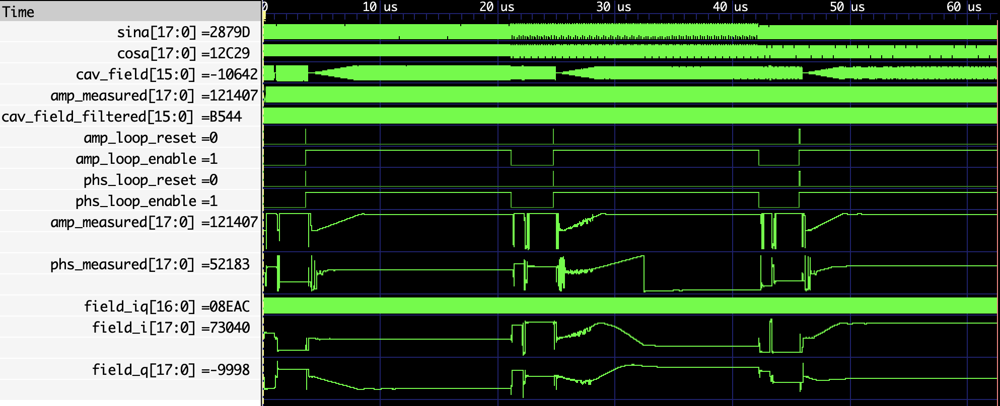

# RTL and Physics Co-Simulation for LLRF

## Getting started

1. Install [`cocotb`](https://docs.cocotb.org/en/stable/install.html) (tested version: 1.8.1) and ['verilator`](https://verilator.org/guide/latest/install.html) (tested version: 5.018);
   ```
   sudo apt install verilator
   pip install cocotb pytest
   ```

2. Build and run simulation:
   ```
   make
   ```

   The test bench will run 3 frequency configurations: `ALSU`, `USPAS` and `LEMP`, and test receiver accuracy, open loop and close loop response correspondingly. The DSP transfer functions are modeled in `llrf_dsp.py` and integrated in the test for automated calibration. The RX and TX phase rotation introduced by latency and digital filters are compensated by phase offsets of the digital down / up conversion, so that there is no need for phase calibration in software.
   Typical verification results:

   ```
        0.00ns INFO     cocotb                             Seeding Python random module with 1711222615
        0.00ns INFO     cocotb.regression                  Found test test_dsp_core.test_alsu
        0.00ns INFO     cocotb.regression                  Found test test_dsp_core.test_uspas
        0.00ns INFO     cocotb.regression                  Found test test_dsp_core.test_lemp
        0.00ns INFO     cocotb.regression                  running test_alsu (1/3)
        0.00ns INFO     cocotb.dsp_core                    ********************  Simulating: ALSU  ********************
        0.00ns INFO     cocotb.dsp_core                    ********************      RX Test       ********************
        0.00ns INFO     cocotb.dsp_core                    LLRFModel RX:
                                                           < DSPCoreRX   :   Amp gain= 4.831,   Phs gain=   -0.00 deg >
                                                           WashoutFilter :   Amp gain= 1.032,   Phs gain= -130.07 deg;
                                                           DDS           :   Amp gain= 0.940,   Phs gain=    0.00 deg;
                                                           DDC           :   Amp gain= 3.023,   Phs gain=  -98.18 deg;
                                                           CORDIC        :   Amp gain= 1.647,   Phs gain= -131.75 deg;
      878.70ns INFO     cocotb.dsp_core                    expected mag: 26451.53 cnt,  phs: 61.351 deg
      887.40ns INFO     cocotb.dsp_core                    measured mag: 26445.70 cnt,  phs: 61.360 deg
      896.10ns INFO     cocotb.dsp_core                    measured mag: 26454.60 cnt,  phs: 61.328 deg
      904.80ns INFO     cocotb.dsp_core                    measured mag: 26463.50 cnt,  phs: 61.295 deg
      913.50ns INFO     cocotb.dsp_core                    measured mag: 26457.08 cnt,  phs: 61.326 deg
      922.20ns INFO     cocotb.dsp_core                    measured mag: 26450.67 cnt,  phs: 61.355 deg
      922.20ns INFO     cocotb.dsp_core                    ********************   Open Loop Test   ********************
      922.20ns INFO     cocotb.dsp_core                    LLRFModel TX:
                                                           < DSPCoreTX   :   Amp gain= 0.387,   Phs gain=    0.00 deg >
                                                           DDS           :   Amp gain= 0.940,   Phs gain=    0.00 deg;
                                                           DUC           :   Amp gain= 0.250,   Phs gain= -163.64 deg;
                                                           CORDIC        :   Amp gain= 1.647,   Phs gain=  163.64 deg;

     3549.60ns INFO     cocotb.dsp_core                    expected mag: 26451.53 cnt,  phs: -85.825 deg
     3558.30ns INFO     cocotb.dsp_core                    measured mag: 26451.08 cnt,  phs: -85.828 deg
     3567.00ns INFO     cocotb.dsp_core                    measured mag: 26451.29 cnt,  phs: -85.828 deg
     3575.70ns INFO     cocotb.dsp_core                    measured mag: 26451.29 cnt,  phs: -85.822 deg
     3584.40ns INFO     cocotb.dsp_core                    measured mag: 26451.29 cnt,  phs: -85.816 deg
     3593.10ns INFO     cocotb.dsp_core                    measured mag: 26451.08 cnt,  phs: -85.820 deg
     3593.10ns INFO     cocotb.dsp_core                    ********************  Close Loop Test   ********************
    21036.60ns INFO     cocotb.dsp_core                    expected mag: 25128.96 cnt,  phs: 36.177 deg
    21045.30ns INFO     cocotb.dsp_core                    measured mag: 25129.28 cnt,  phs: 36.172 deg
    21054.00ns INFO     cocotb.dsp_core                    measured mag: 25128.04 cnt,  phs: 36.175 deg
    21062.70ns INFO     cocotb.dsp_core                    measured mag: 25128.66 cnt,  phs: 36.177 deg
    21071.40ns INFO     cocotb.dsp_core                    measured mag: 25129.28 cnt,  phs: 36.178 deg
    21080.10ns INFO     cocotb.dsp_core                    measured mag: 25130.32 cnt,  phs: 36.177 deg
    21080.10ns INFO     cocotb.regression                  test_alsu passed
    21080.10ns INFO     cocotb.regression                  running test_uspas (2/3)
    21080.10ns INFO     cocotb.dsp_core                    ******************** Simulating: USPAS  ********************
    21080.10ns INFO     cocotb.dsp_core                    ********************      RX Test       ********************
    21080.10ns INFO     cocotb.dsp_core                    LLRFModel RX:
                                                           < DSPCoreRX   :   Amp gain= 5.669,   Phs gain=    0.00 deg >
                                                           WashoutFilter :   Amp gain= 1.031,   Phs gain=  -59.57 deg;
                                                           DDS           :   Amp gain= 0.940,   Phs gain=    0.00 deg;
                                                           DDC           :   Amp gain= 3.552,   Phs gain=  125.22 deg;
                                                           CORDIC        :   Amp gain= 1.647,   Phs gain=  -65.65 deg;

    21967.50ns INFO     cocotb.dsp_core                    expected mag: 22544.21 cnt,  phs: 98.485 deg
    21976.20ns INFO     cocotb.dsp_core                    measured mag: 22543.12 cnt,  phs: 98.494 deg
    21984.90ns INFO     cocotb.dsp_core                    measured mag: 22543.82 cnt,  phs: 98.486 deg
    21993.60ns INFO     cocotb.dsp_core                    measured mag: 22544.70 cnt,  phs: 98.477 deg
    22002.30ns INFO     cocotb.dsp_core                    measured mag: 22543.29 cnt,  phs: 98.480 deg
    22011.00ns INFO     cocotb.dsp_core                    measured mag: 22541.88 cnt,  phs: 98.483 deg
    22011.00ns INFO     cocotb.dsp_core                    ********************   Open Loop Test   ********************
    22011.00ns INFO     cocotb.dsp_core                    LLRFModel TX:
                                                           < DSPCoreTX   :   Amp gain= 0.387,   Phs gain=   -0.00 deg >
                                                           DDS           :   Amp gain= 0.940,   Phs gain=    0.00 deg;
                                                           DUC           :   Amp gain= 0.250,   Phs gain=  109.57 deg;
                                                           CORDIC        :   Amp gain= 1.647,   Phs gain= -109.57 deg;

    24638.40ns INFO     cocotb.dsp_core                    expected mag: 22544.21 cnt,  phs: 69.647 deg
    24647.10ns INFO     cocotb.dsp_core                    measured mag: 22543.29 cnt,  phs: 69.642 deg
    24655.80ns INFO     cocotb.dsp_core                    measured mag: 22542.76 cnt,  phs: 69.645 deg
    24664.50ns INFO     cocotb.dsp_core                    measured mag: 22543.64 cnt,  phs: 69.645 deg
    24673.20ns INFO     cocotb.dsp_core                    measured mag: 22544.53 cnt,  phs: 69.645 deg
    24681.90ns INFO     cocotb.dsp_core                    measured mag: 22544.88 cnt,  phs: 69.645 deg
    24681.90ns INFO     cocotb.dsp_core                    ********************  Close Loop Test   ********************
    42125.40ns INFO     cocotb.dsp_core                    expected mag: 21417.00 cnt,  phs: -169.637 deg
    42134.10ns INFO     cocotb.dsp_core                    measured mag: 21417.45 cnt,  phs: -169.637 deg
    42142.80ns INFO     cocotb.dsp_core                    measured mag: 21418.16 cnt,  phs: -169.639 deg
    42151.50ns INFO     cocotb.dsp_core                    measured mag: 21416.92 cnt,  phs: -169.636 deg
    42160.20ns INFO     cocotb.dsp_core                    measured mag: 21415.69 cnt,  phs: -169.634 deg
    42168.90ns INFO     cocotb.dsp_core                    measured mag: 21416.92 cnt,  phs: -169.636 deg
    42168.90ns INFO     cocotb.regression                  test_uspas passed
    42168.90ns INFO     cocotb.regression                  running test_lemp (3/3)
    42168.90ns INFO     cocotb.dsp_core                    ********************  Simulating: LEMP  ********************
    42168.90ns INFO     cocotb.dsp_core                    ********************      RX Test       ********************
    42168.90ns INFO     cocotb.dsp_core                    LLRFModel RX:
                                                           < DSPCoreRX   :   Amp gain= 6.228,   Phs gain=   -0.00 deg >
                                                           WashoutFilter :   Amp gain= 1.031,   Phs gain=  -74.83 deg;
                                                           DDS           :   Amp gain= 0.940,   Phs gain=    0.00 deg;
                                                           DDC           :   Amp gain= 3.900,   Phs gain=  154.29 deg;
                                                           CORDIC        :   Amp gain= 1.647,   Phs gain=  -79.46 deg;

    43025.70ns INFO     cocotb.dsp_core                    expected mag: 20519.38 cnt,  phs: -127.970 deg
    43034.10ns INFO     cocotb.dsp_core                    measured mag: 20506.82 cnt,  phs: -128.009 deg
    43042.50ns INFO     cocotb.dsp_core                    measured mag: 20512.92 cnt,  phs: -127.966 deg
    43050.90ns INFO     cocotb.dsp_core                    measured mag: 20519.18 cnt,  phs: -127.925 deg
    43059.30ns INFO     cocotb.dsp_core                    measured mag: 20522.72 cnt,  phs: -127.969 deg
    43067.70ns INFO     cocotb.dsp_core                    measured mag: 20526.25 cnt,  phs: -128.014 deg
    43067.70ns INFO     cocotb.dsp_core                    ********************   Open Loop Test   ********************
    43067.70ns INFO     cocotb.dsp_core                    LLRFModel TX:
                                                           < DSPCoreTX   :   Amp gain= 0.387,   Phs gain=    0.00 deg >
                                                           DDS           :   Amp gain= 0.940,   Phs gain=    0.00 deg;
                                                           DUC           :   Amp gain= 0.250,   Phs gain=   51.43 deg;
                                                           CORDIC        :   Amp gain= 1.647,   Phs gain=  -51.43 deg;

    45604.50ns INFO     cocotb.dsp_core                    expected mag: 20519.38 cnt,  phs: -75.662 deg
    45612.90ns INFO     cocotb.dsp_core                    measured mag: 20518.54 cnt,  phs: -75.663 deg
    45621.30ns INFO     cocotb.dsp_core                    measured mag: 20519.02 cnt,  phs: -75.664 deg
    45629.70ns INFO     cocotb.dsp_core                    measured mag: 20518.70 cnt,  phs: -75.663 deg
    45638.10ns INFO     cocotb.dsp_core                    measured mag: 20518.38 cnt,  phs: -75.661 deg
    45646.50ns INFO     cocotb.dsp_core                    measured mag: 20519.02 cnt,  phs: -75.661 deg
    45646.50ns INFO     cocotb.dsp_core                    ********************  Close Loop Test   ********************
    62488.50ns INFO     cocotb.dsp_core                    expected mag: 19493.41 cnt,  phs: 71.660 deg
    62496.90ns INFO     cocotb.dsp_core                    measured mag: 19493.34 cnt,  phs: 71.658 deg
    62505.30ns INFO     cocotb.dsp_core                    measured mag: 19492.05 cnt,  phs: 71.657 deg
    62513.70ns INFO     cocotb.dsp_core                    measured mag: 19493.18 cnt,  phs: 71.660 deg
    62522.10ns INFO     cocotb.dsp_core                    measured mag: 19494.46 cnt,  phs: 71.664 deg
    62530.50ns INFO     cocotb.dsp_core                    measured mag: 19493.66 cnt,  phs: 71.662 deg
    62530.50ns INFO     cocotb.regression                  test_lemp passed
    62530.50ns INFO     cocotb.regression                  **************************************************************************************
                                                           ** TEST                          STATUS  SIM TIME (ns)  REAL TIME (s)  RATIO (ns/s) **
                                                           **************************************************************************************
                                                           ** test_dsp_core.test_alsu        PASS       21080.10           0.81      26118.71  **
                                                           ** test_dsp_core.test_uspas       PASS       21088.80           0.80      26476.77  **
                                                           ** test_dsp_core.test_lemp        PASS       20361.60           1.08      18937.34  **
                                                           **************************************************************************************
                                                           ** TESTS=3 PASS=3 FAIL=0 SKIP=0              62530.50           2.91      21497.60  **
                                                           **************************************************************************************
   ```

3. Check waveform:
   ```
   gtkwave dump.fst dump.gtkw
   ```
   Typical result:
   